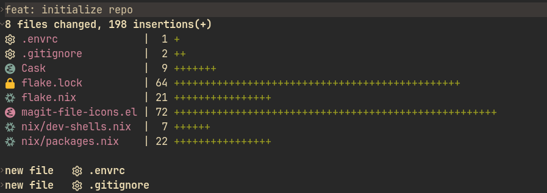

<h1 align="center">
    magit-file-icons.el
    
</h1>

Display icons for filenames in  buffers!

<div>
    <a href="https://github.com/gekoke/magit-file-icons/actions"></a>
    <a href="https://github.com/gekoke/magit-file-icons/releases/latest"></a>
    <a href="https://opensource.org/license/gpl-3-0"></a>
</div>

# Preview




# Installation
You can install this package from [MELPA](https://melpa.org/#/magit-file-icons).

For example, with `use-package`:

```elisp
(use-package magit-file-icons
  :ensure t
  :init
  (magit-file-icons-mode 1)
  :custom
  ;; These are the default values:
  (magit-file-icons-enable-diff-file-section-icons t)
  (magit-file-icons-enable-untracked-icons t)
  (magit-file-icons-enable-diffstat-icons t))
```

If you are using some other method to install, you will need to ensure the following dependencies:

- `el-patch`
- `nerd-icons`
- `magit`

## Nix

Alternatively, you can use Nix. This repository is a flake and outputs the following packages (versions omitted):

```
└───packages
    ├───aarch64-darwin
    │   ├───default: package 'emacs-magit-file-icons-vX.X.X'
    │   └───magit-file-icons: package 'emacs-magit-file-icons-vX.X.X'
    ├───aarch64-linux
    │   ├───default: package 'emacs-magit-file-icons-vX.X.X'
    │   └───magit-file-icons: package 'emacs-magit-file-icons-vX.X.X'
    ├───x86_64-darwin
    │   ├───default: package 'emacs-magit-file-icons-vX.X.X'
    │   └───magit-file-icons: package 'emacs-magit-file-icons-vX.X.X'
    └───x86_64-linux
        ├───default: package 'emacs-magit-file-icons-vX.X.X'
        └───magit-file-icons: package 'emacs-magit-file-icons-vX.X.X'
```

A minimal flake for creating an Emacs with the `magit-file-icons` package could look like this:

```nix
{
  inputs = {
    nixpkgs.url = "github:nixos/nixpkgs/nixos-unstable";

    magit-file-icons.url = "github:gekoke/magit-file-icons";
    magit-file-icons.inputs.nixpkgs.follows = "nixpkgs";
  };

  outputs =
    inputs:
    let
      pkgs = import inputs.nixpkgs { system = "x86_64-linux"; };
    in
    {
      packages."x86_64-linux".default = pkgs.emacsWithPackages (p: [
        inputs.magit-file-icons.packages."x86_64-linux".default
      ]);
    };
}
```

# Commentary

This package uses [nerd-icons.el](https://github.com/rainstormstudio/nerd-icons.el) to render icons. Currently, this is the
only supported icon backend.

The author is not opposed to adding additional icon backends — such as [all-the-icons.el](https://github.com/domtronn/all-the-icons.el)
or [vscode-icons-emacs](https://github.com/jojojames/vscode-icon-emacs) — in the future.

